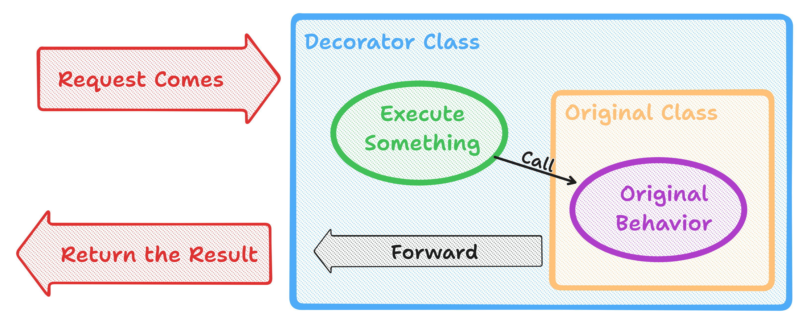

# Decorator Pattern

This is a structural design pattern, that allows an object to be dynamically enhanced with new behaviors without changing the original behavior.

## How it works

The decorator object wraps the original class, containing new behaviors, like the diagram below:

